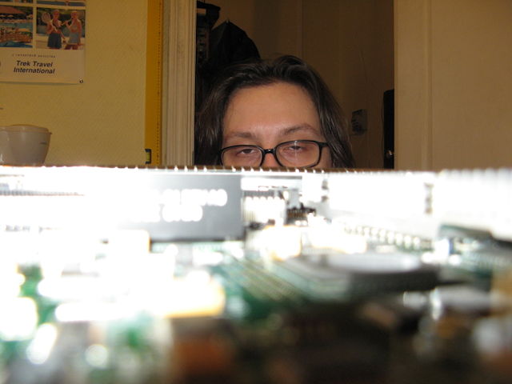
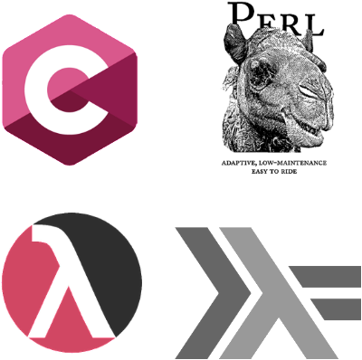
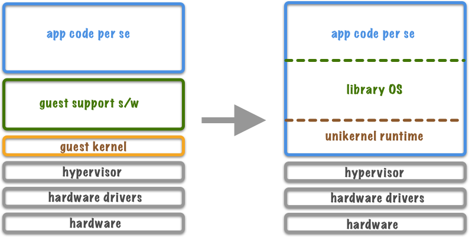
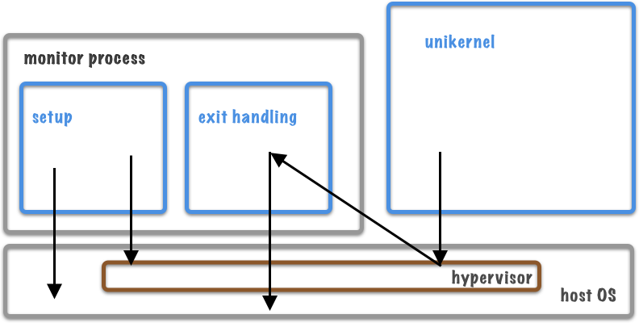

title: Unikernel Experiment
subtitle: Theory, practice and perspective
class: animation-fade
layout: true

.bottom-bar[{{title}}]

---

class: impact

# {{title}}
## {{subtitle}}
### @argent_smith
### Evrone.com
### f(by)

---

### ~$ whoami

.col-7[

]

--

.col-5[
&nbsp; &nbsp; 
]

---

### ~$ whoami

.col-7[

]

--

.col-5[
&nbsp; &nbsp; 
]

---

### ~$ man 8 unikernel | grep Arch

.col-9[

]

--

.col-3[
Unikernel be like:

* Framework
* Binary image
* Library OS
]

---

### ~$ man 8 unikernel | grep Examples

#### unikernel.org

.col-6[
* **ClickOS**, C++
* **Clive**, Go
* **HaLVM**, Haskell
* **LING**, Erlang
* **Rumprun**, NetBSD
* **MirageOS**, OCaml
]

.col-6[
 &nbsp; &nbsp; &nbsp;


 &nbsp; &nbsp; &nbsp;  &nbsp; &nbsp; &nbsp;  &nbsp; &nbsp; 
]

---

### ~$ man 8 unikernel | grep Isolation

.col-9[

]

.col-3[
Keywords:

* unilernel
* monitor
* tender
* setup
* exit handling

]

---

### ~$ man 8 unikernel | grep WTF

.col-6[
#### Pros
1. Tooling (as in Mirage)
2. Lightweight
3. Isolated
]

--

.col-6[
#### Cons
1. Tooling (as in gdb)
2. Tooling (as in cloud services)
3. Double virtualization problem
]

---

### ~$ make OS

#### The Task

* Linux/KVM/Proxmox &mdash; already tested, not interesting

--

* Some ppl want to know if it's viable on small devices

--

* Want to run on something really small

--

* Let's go for **Raspberry Pi 3B**

  * Compact
  * ARM64

---

### ~$ make OS

#### The Thing

* **Hypriot OS** (blog.hypriot.com) &mdash; *Just used to it*

--

* **Prereqs**: Docker for Mac, Virtualbox

--

* **DieterReuter/image-builder-rpi64** -> **argent-smith/image-builder-rpi64**

--

* **DieterReuter/rpi64-kernel** -> **argent-smith/rpi64-kernel**

  ```
  ### KVM THINGS ###
  ...
  CONFIG_KVM=y
  CONFIG_KVM_ARM_HOST=y
  ...
  ### END KVM THINGS
  ```

---

### ~$ make unikernel

argent-smith/mirage-presentation-server

``` shellsession
⟩ ls -hla
total 48
drwxr-xr-x  11 paul  staff   352B 19 янв 18:44 .
drwxr-xr-x   7 paul  staff   224B 18 янв 16:57 ..
drwxr-xr-x  14 paul  staff   448B 23 янв 18:14 .git
-rw-r--r--   1 paul  staff   132B 19 янв 18:44 .gitignore
-rw-r--r--   1 paul  staff   166B 19 янв 18:44 .merlin
-rw-r--r--   1 paul  staff   1,2K 19 янв 18:44 LICENSE
-rw-r--r--   1 paul  staff   509B 19 янв 18:44 README.md
-rw-r--r--   1 paul  staff   669B 19 янв 18:44 config.ml
drwxr-xr-x   4 paul  staff   128B 19 янв 18:44 site
-rw-r--r--   1 paul  staff   2,0K 19 янв 18:44 unikernel.ml
```

---

### ~$ make unikernel

config.ml

``` ocaml
open Mirage

let stack = generic_stackv4 default_network
let data_key = Key.(value @@ kv_ro ~group:"data" ())
let data = generic_kv_ro ~key:data_key "site"
let http_srv = http_server @@ conduit_direct ~tls:false stack

let http_port =
  let doc = Key.Arg.info ~doc:"HTTP port to listen" ["http"] in
  Key.(create "http_port" Arg.(opt int 8080 doc))

let main =
  let packages = [
      package "uri"; package "magic-mime"
    ] in
  let keys = List.map Key.abstract [ http_port ] in
  foreign
    ~packages ~keys
    "Unikernel.CUSTOM_HTTP" (pclock @-> kv_ro @-> http @-> job)

let () =
  register "presentation-server" [ main $ default_posix_clock $ data $ http_srv ]
```

---

### ~$ make unikernel

unikernel.ml

``` ocaml
open Lwt.Infix

(* ... *)

module CUSTOM_HTTP
         (Pclock : Mirage_types.PCLOCK)
         (DATA   : Mirage_types_lwt.KV_RO)
         (Http   : HTTP) = struct

  module D = Dispatch (DATA) (Http)

  let start _clock data http =
    let http_port = Key_gen.http_port () in
    let tcp = `TCP http_port in
    let http =
      Http_log.info (fun f -> f "listening on %d/TCP" http_port);
      http tcp @@ D.serve (D.dispatcher data)
    in
    http
end
```

---

### ~$ make unikernel

#### Build Outline

--
1. Set up a docker machine on RPi

--
2. Run the **OPAM** container (`argentoff/opam` @ docker hub):
  ```shellsession
  $ docker run -it -v presentation-dev:/home/dev --name=mirage-work argentoff/opam:arm64v8_...
  ```
--
3. In the container, make the things

  ```shellsession
  $ git clone https://github.com/argent-smith/mirage-presentation-server.git

  $ cd mirage-presentation-server

  $ opam install mirage

  $ mirage configure -t hvt

  $ make depend

  $ make
  ```

---

### ~$ make unikernel

**Artifacts, the**

``` shellsession
bash-4.4$ ls -hla
total 7452
drwxr-sr-x    6 dev      dev         4.0K Jan 23 15:41 .
drwxr-sr-x    4 dev      dev         4.0K Jan 22 18:56 ..

...

-rwxr-xr-x    1 dev      dev         7.1M Jan 23 15:40 presentation_server.hvt
-rwxr-xr-x    1 dev      dev        99.9K Jan 23 15:41 solo5-hvt

...
```

Extra:

1. `docker copy` the contents to container's `~/site` dir & re-run `make` if needed
2. `docker copy` the artifacts to local fs (or to the machine it'll run on)

---

### ~# systemctl start presentation

**NB:** this IS an experiment, beware dragons

1. sorry, we'll need `musl`
2. /etc/network/interfaces.d/tap100
   ``` txt
   auto tap100
   iface tap100 inet manual
      pre-up ip tuntap add tap100 mode tap
   ```

3. /etc/network/interfaces.d/br100
   ``` txt
   auto br100
   iface br100 inet static
      bridge_ports tap100 eth0
      address 10.0.0.1
      netmask 255.255.255.0
      post-up iptables -I FORWARD 1 -o $IFACE -j ACCEPT
   ```

---

### ~# systemctl start presentation

/etc/systemd/system/presentation.service

``` txt
[Unit]
Description=Presenation Unikernel Service
After=network.target

[Service]
Restart=always
RestartSec=1
User=pirate
Group=kvm
WorkingDirectory=/home/pirate/work
ExecStart=/home/pirate/work/solo5-hvt --net=tap100 --mem=64M -- presentation_server.hvt --ipv4=10.0.0.2/24

[Install]
WantedBy=multi-user.target
```

---

### ~# systemctl start presentation

`# journalctl -fu presentation.service`

``` txt
systemd[1]: Started Presenation Unikernel Service.
solo5-hvt[26446]:             |      ___|
solo5-hvt[26446]:   __|  _ \  |  _ \ __ \
solo5-hvt[26446]: \__ \ (   | | (   |  ) |
solo5-hvt[26446]: ____/\___/ _|\___/____/
solo5-hvt[26446]: Solo5: Memory map: 64 MB addressable:
solo5-hvt[26446]: Solo5:     unused @ (0x0 - 0xfffff)
solo5-hvt[26446]: Solo5:       text @ (0x100000 - 0x3a6fff)
solo5-hvt[26446]: Solo5:     rodata @ (0x3a7000 - 0x40bfff)
solo5-hvt[26446]: Solo5:       data @ (0x40c000 - 0x800fff)
solo5-hvt[26446]: Solo5:       heap >= 0x801000 < stack < 0x4000000
solo5-hvt[26446]: 2019-01-23 12:12:36 -00:00: INF [netif] Plugging into 0 with mac 8a:6f:ee:41:ce:bc
solo5-hvt[26446]: 2019-01-23 12:12:36 -00:00: INF [ethif] Connected Ethernet interface 8a:6f:ee:41:ce:bc
solo5-hvt[26446]: 2019-01-23 12:12:36 -00:00: INF [arpv4] Connected arpv4 device on 8a:6f:ee:41:ce:bc
solo5-hvt[26446]: 2019-01-23 12:12:36 -00:00: INF [udp] UDP interface connected on 10.0.0.2
solo5-hvt[26446]: 2019-01-23 12:12:36 -00:00: INF [tcpip-stack-direct] stack assembled: mac=8a:6f:ee:41:ce:bc,ip=10.0.0.2
solo5-hvt[26446]: 2019-01-23 12:12:36 -00:00: INF [http] listening on 8080/TCP
solo5-hvt[26446]: 2019-01-23 12:13:04 -00:00: INF [http] [1] serving //10.0.0.2:8080/
```

---

### ~$ echo thanks

.big.center[
@argent_smith

`github/argent-smith`

evrone.com
]

<br>
<br>
<br>

.center[
Huge thanks to all ppl @ **mirage.io** who make this possible!
]
